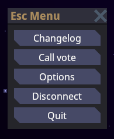
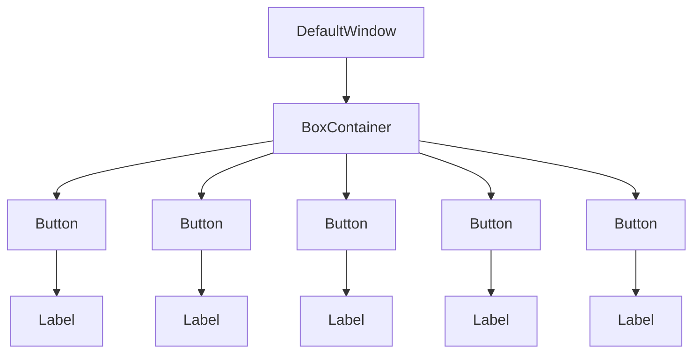
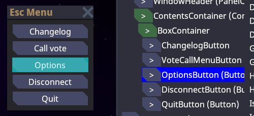
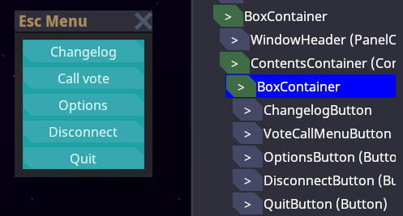
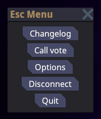
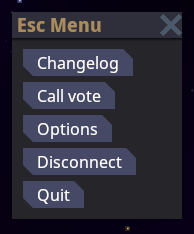
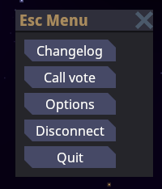
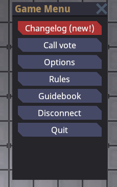
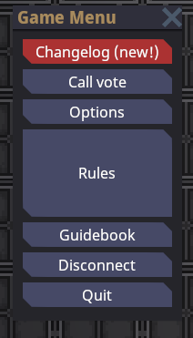
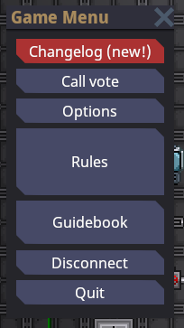

# Пользовательский интерфейс

!!! warning "Предупреждение"
    Это перевод на русский язык [одной из страниц из официальной документации](https://docs.spacestation14.com/en/robust-toolbox/user-interface.html) Space Station 14, прошедший нашу дополнительную редакцию.

Знаете, иногда так лень придумывать красивый вступительный абзац. Поэтому просто скажем: это руководство по UI.

!!! info "Информация"
    Автодополнение кода (IntelliSense) — ваш лучший помощник в поиске доступных элементов управления и их свойств

## Что такое `Control`?

Весь UI игры состоит из множества `Control` (элементов управления). Каждый `Control` — это один кирпичик в системе интерфейсов. Они выполняют разные функции: от простых текстовых меток и кнопок до сложных контейнеров для автоматической компоновки.



Перед вами типичный игровой интерфейс. Как видите, это окно с несколькими кнопками. Но есть ещё один скрытый компонент — `BoxContainer`, который автоматически выравнивает кнопки вертикально.

Вот как выглядит XAML-код этого интерфейса (не пугайтесь, мы всё объясним):

```xml
<DefaultWindow xmlns="https://spacestation14.io"
            xmlns:changelog="clr-namespace:Content.Client.Changelog"
            xmlns:ui="clr-namespace:Content.Client.Voting.UI"
            Title="{Loc 'ui-escape-title'}"
            Resizable="False">

    <BoxContainer Orientation="Vertical" SeparationOverride="4" MinWidth="150">
        <changelog:ChangelogButton />
        <ui:VoteCallMenuButton />
        <Button Name="OptionsButton" Text="{Loc 'ui-escape-options'}" />
        <Button Name="DisconnectButton" Text="{Loc 'ui-escape-disconnect'}" />
        <Button Name="QuitButton" Text="{Loc 'ui-escape-quit'}" />
    </BoxContainer>
</DefaultWindow>
```

Здесь `DefaultWindow` содержит `BoxContainer` для вертикального выравнивания кнопок. Сами кнопки автоматически создают внутри себя `Label` для текста. Так формируется древовидная структура:



### Основы компоновки

Правильная расстановка элементов — важнейшая часть разработки UI. Ручное указание позиций утомительно и плохо масштабируется. Поэтому мы используем специальные контейнеры вроде `BoxContainer`.

Сначала разберём базовые принципы для *отдельного* элемента, а потом перейдём к контейнерам.

Каждый элемент — это прямоугольник с размером и позицией относительно родителя. На скриншоте видна рамка одной кнопки:



*(Чтобы увидеть такие рамки, используйте `devwindow` в консоли → вкладка UI)*

А вот контейнер `BoxContainer`, содержащий все кнопки:



Ключевые понятия компоновки:

**`DesiredSize`** — "идеальный размер" элемента, который ему нужен для правильного отображения. Рассчитывается на основе содержимого:
- `Label` → размер текста
- `TextureRect` → размер изображения
- `BoxContainer` → суммарный размер дочерних элементов
- `Button` → размер контента + отступы рамки

Но на практике элементы часто получают **больше места**, чем им нужно. Например, в меню паузы кнопки растягиваются по ширине окна. 

Это поведение регулируется свойствами:
- `HorizontalAlignment` — выравнивание по горизонтали
- `VerticalAlignment` — выравнивание по вертикали

Доступные значения: 
- `Stretch` (растянуть) — значение по умолчанию
- `Center` (центрировать)
- `Left`/`Right` и `Top`/`Bottom` (прижать к краю)

Поэкспериментируем с `HorizontalAlignment`:  

Кнопки с `HorizontalAlignment="Center"`:  


<details>
  <summary>Код</summary>
  
  ```xml
    <BoxContainer Orientation="Vertical" SeparationOverride="4" MinWidth="150">
        <changelog:ChangelogButton  HorizontalAlignment="Center" />
        <ui:VoteCallMenuButton HorizontalAlignment="Center" />
        <Button HorizontalAlignment="Center" Name="OptionsButton" Text="{Loc 'ui-escape-options'}" />
        <Button HorizontalAlignment="Center" Name="DisconnectButton" Text="{Loc 'ui-escape-disconnect'}" />
        <Button HorizontalAlignment="Center" Name="QuitButton" Text="{Loc 'ui-escape-quit'}" />
    </BoxContainer>
  ```
</details>

Кнопки с `HorizontalAlignment="Left"`:  


<details>
  <summary>Код</summary>
  
  ```xml
    <BoxContainer Orientation="Vertical" SeparationOverride="4" MinWidth="150">
        <changelog:ChangelogButton  HorizontalAlignment="Left" />
        <ui:VoteCallMenuButton HorizontalAlignment="Left" />
        <Button HorizontalAlignment="Left" Name="OptionsButton" Text="{Loc 'ui-escape-options'}" />
        <Button HorizontalAlignment="Left" Name="DisconnectButton" Text="{Loc 'ui-escape-disconnect'}" />
        <Button HorizontalAlignment="Left" Name="QuitButton" Text="{Loc 'ui-escape-quit'}" />
    </BoxContainer>
  ```
</details>

Контейнер с `HorizontalAlignment="Left"` (кнопки растягиваются под размер самой широкой):  


<details>
  <summary>Код</summary>

  Важно: здесь `MinSize` перенесён на родительский контейнер

  ```xml
    <Control MinWidth="150">
        <BoxContainer Orientation="Vertical" HorizontalAlignment="Left" SeparationOverride="4">
            <changelog:ChangelogButton  />
            <ui:VoteCallMenuButton />
            <Button Name="OptionsButton" Text="{Loc 'ui-escape-options'}" />
            <Button Name="DisconnectButton" Text="{Loc 'ui-escape-disconnect'}" />
            <Button Name="QuitButton" Text="{Loc 'ui-escape-quit'}" />
        </BoxContainer>
    </Control>
  ```
</details>

Другие полезные свойства:  
- `MinSize`/`MinWidth`/`MinHeight` — минимальный размер  
- `MaxSize`/`MaxWidth`/`MaxHeight` — максимальный размер  
- `SetSize`/`SetWidth`/`SetHeight` — фиксированный размер  
- `Margin` — внешние отступы  

## Контейнеры для компоновки

Специальные элементы, которые автоматически выравнивают дочерние компоненты:

### `BoxContainer`
Располагает элементы последовательно:
- `Orientation="Vertical"` — вертикально (сверху вниз)
- `Orientation="Horizontal"` — горизонтально (слева направо)

### `GridContainer`
Сетка с настраиваемыми столбцами и строками.

### `ScrollContainer` (TODO)
Контейнер с прокруткой.

### `LayoutContainer` (TODO)
Продвинутая компоновка.

## Общие атрибуты
### Margin
Внешние отступы элемента:
```xml
<BoxContainer Orientation="Vertical" Margin="4">
    <Label Text="Заголовок 1" />
    <Label Text="Заголовок 2" />
</BoxContainer>
```
Форматы:  
- `Margin="4"` — равные отступы  
- `Margin="10 5"` — горизонтальные и вертикальные  
- `Margin="5 0 5 10"` — лево, верх, право, низ  

### HorizontalExpand / VerticalExpand

**Важно!** Эти свойства часто используют неправильно. Они работают **только внутри**:  
- `BoxContainer`  
- `SplitContainer`  
- `GridContainer`  

И влияют на то, как контейнер распределяет свободное пространство. 

Пример без `VerticalExpand` (пустое место внизу):  


Одна кнопка с `VerticalExpand="True"` забирает всё свободное место:  


<details>
  <summary>Код</summary>
  
  ```xml
    <BoxContainer Orientation="Vertical" SeparationOverride="4" MinWidth="150" MinHeight="300">
        <!-- ... -->
        <Button VerticalExpand="True" Text="Правила сервера" />
        <!-- ... -->
    </BoxContainer>
  ```
</details>

Если несколько элементов с `Expand`, пространство делится пропорционально `SizeFlagsStretchRatio`:  


<details>
  <summary>Код</summary>
  
  ```xml
    <BoxContainer ...>
        <!-- ... -->
        <Button VerticalExpand="True" SizeFlagsStretchRatio="1.5" Text="Правила" />
        <Button VerticalExpand="True" Text="Гайдбук" />
        <!-- ... -->
    </BoxContainer>
  ```
</details>

**Запомните:**  
- `Horizontal/VerticalAlignment` — поведение элемента внутри выделенного места  
- `Horizontal/VerticalExpand` — как контейнер выделяет место элементам  

## XAML для UI

Сложные интерфейсы проще создавать через XAML — декларативный язык разметки. Пример:

```xml
<DefaultWindow xmlns="https://spacestation14.io"
            Title="Меню паузы"
            Resizable="False">

    <BoxContainer Orientation="Vertical" Margin="4" MinWidth="150">
        <Button Text="Настройки" />
        <Button Text="Отключиться" />
        <Button Text="Выйти" />
    </BoxContainer>
</DefaultWindow>
```

### Синтаксис
XAML описывает объекты .NET через XML-теги:

#### Базовый синтаксис
```xml
<!-- Самозакрывающийся тег -->
<Button />

<!-- Тег с содержимым -->
<BoxContainer>
  <Button />
</BoxContainer>

<!-- Атрибуты -->
<Button Text="OK" Margin="5" />
```

#### Пространства имён
Импорт типов из .NET:
```xml
<Control xmlns="https://spacestation14.io"
         xmlns:x="http://schemas.microsoft.com/winfx/2006/xaml"
         xmlns:gfx="clr-namespace:Robust.Client.Graphics;assembly=Robust.Client">
```

#### Расширения разметки
Специальные конструкции в фигурных скобках:
```xml
<!-- Локализация -->
<Button Text="{Loc 'ui-escape-options'}" />

<!-- Привязка данных -->
<Label Text="{Binding PlayerName}" />
```

### Использование XAML
1. Создайте файлы:
   - `FooControl.xaml` — разметка
   - `FooControl.xaml.cs` — код

2. В C#-классе:
```cs
[GenerateTypedNameReferences]
public partial class FooControl : Control
{
    public FooControl()
    {
        RobustXamlLoader.Load(this);
    }
}
```

3. В XAML:
```xml
<Control xmlns="https://spacestation14.io">
    <Button Name="MyButton" Text="Нажми меня!" />
</Control>
```

!!! info "Информация"
    Если Rider не видит MyButton в коде — попробуйте пересобрать проект. Генераторы кода иногда капризничают.

## Контроллеры UI
Отвечают за создание, обновление и удаление элементов. **Важно:** системы (entity systems) не должны делать это напрямую.

### Особенности:
- Наследуйте от `UIController`
- Создаются автоматически как синглтоны
- Получают виджеты через `UIManager.GetActiveUIWidgetOrNull<T>()`
- Живут дольше, чем entity systems

### Зависимости
```cs
public sealed class MyUIController : UIController
{
    // Обычные зависимости
    [Dependency] private readonly IPlayerManager _playerManager = default!;
    
    // Зависимости от систем
    [UISystemDependency] private readonly MySystem _system = default!;

    public override void Initialize()
    {
        // Подписка на события других контроллеров
        _otherController.OnEvent += HandleEvent;
        
        // Подписка на игровые события
        SubscribeLocalEvent<PlayerAttachedEvent>(OnPlayerAttached);
    }
}
```

### Интерфейсы для состояний
```cs
// Реакция на смену игрового состояния
public void OnStateEntered(GameplayState state)
{
    CommandBinds.Builder
        .Bind(EngineKeyFunctions.Use, new PointerInputCmdHandler(HandleUse))
        .Register<MyUIController>();
}

public void OnStateExited(GameplayState state)
{
    CommandBinds.Unregister<MyUIController>();
}

// Реакция на загрузку/выгрузку системы
public void OnSystemLoaded(MySystem system)
{
    system.MyEvent += HandleSystemEvent;
}

public void OnSystemUnloaded(MySystem system)
{
    system.MyEvent -= HandleSystemEvent;
}
```
